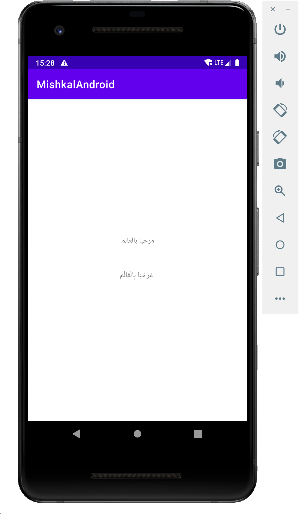

# chaquopy-mishkal

This is an example for running a Python library (mishkal) in Android using chaquopy

<p align="left">
  
</p>

## Code

All the code that has been added to run the python library is located between a two comments `python-start`
and `python-end`.

The following files has been changed/added:

- [build.gradle](build.gradle) => adding chaquopy plugin
- [app/build.gradle](app/build.gradle) => installing python external libraries using pip
- [app/requirements.txt](app/requirements.txt) => python requirements
- [app/src/main/python/mishkal_module.py](app/src/main/python/mishkal_module.py) => wrapping the python library inside a
  function
- [app/src/main/java/io/nask/mishkalandroid/MainActivity.kt](app/src/main/java/io/nask/mishkalandroid/MainActivity.kt)
  calling the function in the main activity
- [local.properties](local.properties) => (optional) adding the chaquopy license key to your local.properties file

```
# python-start
chaquopy.license=<your_license_key>
# python-end 
```

You can get free license for your open source project
at [https://chaquo.com/chaquopy/free-license/](https://chaquo.com/chaquopy/free-license/)

## Chaquopy

- chaquopy [https://chaquo.com/chaquopy/](https://chaquo.com/chaquopy/)
- chaquopy docs [https://chaquo.com/chaquopy/doc/current/](https://chaquo.com/chaquopy/doc/current/)
- chaquopy license [https://chaquo.com/chaquopy/license/](https://chaquo.com/chaquopy/license/)


